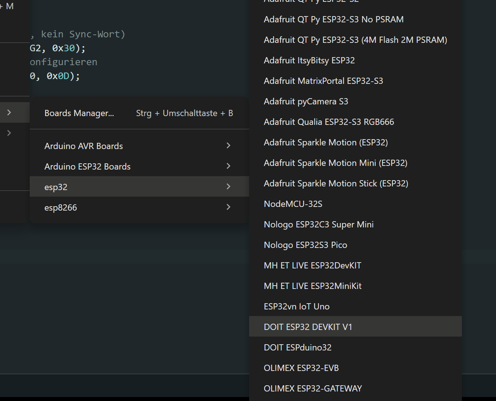
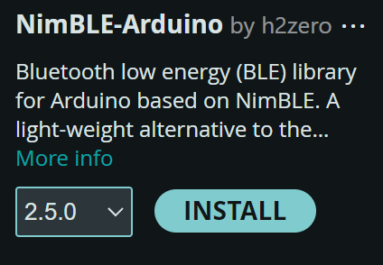
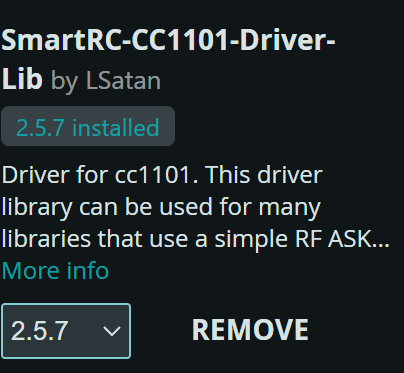

# Installation Guide

1. Install the `esp32` board package by Espressif Systems in the Arduino IDE.

2. Install the USB-to-UART driver:
     1. Open the Silicon Labs download page:
            https://www.silabs.com/software-and-tools/usb-to-uart-bridge-vcp-drivers?tab=downloads
     2. Download the **CP210x Universal Windows Driver**.
     3. Right-click `silabser.inf` and select **Install**.

3. In the Arduino IDE, select the board **DOIT ESP32 DEVKIT V1**.

4. Install the required libraries:
     - `NimBLEDevice`

         

     - `ELECHOUSE_CC1101_SRC_DRV`

         
