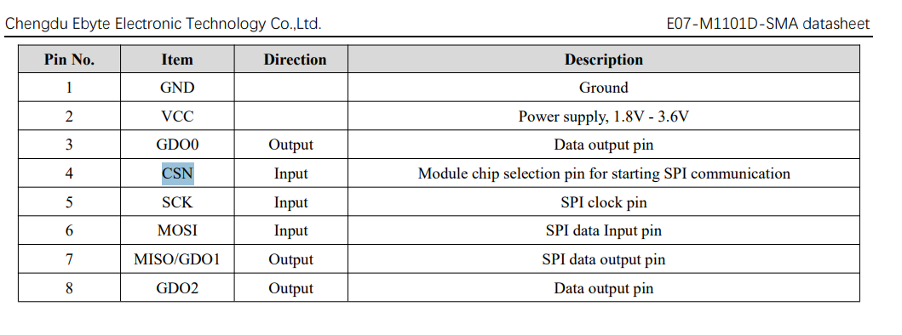
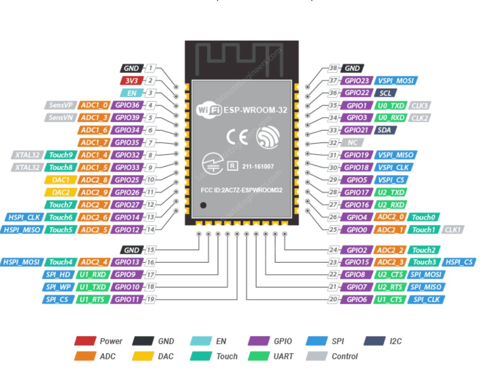

### CC1101 to ESP32 Wiring Diagram

| CC1101 Pin | ESP32 Pin (GPIO) | Common Name / Function |
| :--- | :--- | :--- |
| **VCC (2)** | 3.3V | **Important:** Do NOT connect to 5V! |
| **GND (1)** | GND | Ground |
| **SI (6)** | GPIO 23 | MOSI (Master Out Slave In) |
| **SO (7)** | GPIO 19 | MISO (Master In Slave Out) |
| **SCK (5)** | GPIO 18 | SCK (Serial Clock) |
| **CSN (4)** | GPIO 5 | CS / SS (Chip Select) |
| **GDO0 (3)** | GPIO 2 | GD0 (General Purpose / Interrupt) |
| **GDO2 (8)** | GPIO 4 | GD2 (Optional Interrupt) |

https://lastminuteengineers.com/esp32-wroom-32-pinout-reference/

